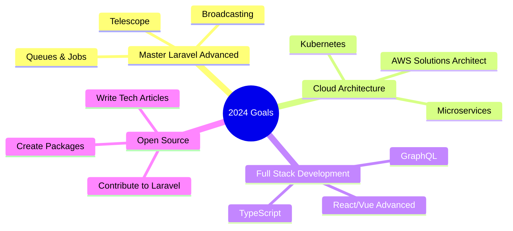

<div align="center">
  
</div>

<div align="center">
  
</div>

<div align="center">
  
</div>

<div align="center">
  
  
  
  
</div>

<br>

<div align="center">
  
</div>

---

<h2 align="center">🚀 ABOUT THE DEVELOPER</h2>

<div align="center">
  
</div>

```javascript
class Developer {
    constructor() {
        this.name = "Kelvianov";
        this.role = "Backend Developer";
        this.language_spoken = ["id_ID", "en_US"];
        this.location = "Indonesia 🇮🇩";
        this.passion = "Building scalable solutions";
    }

    get skills() {
        return {
            backend: ["PHP", "Laravel", "Node.js", "Python"],
            frontend: ["JavaScript", "Vue.js", "React", "HTML/CSS"],
            database: ["MySQL", "PostgreSQL", "MongoDB", "Redis"],
            devops: ["Docker", "AWS", "Linux", "Nginx"],
            tools: ["Git", "Postman", "VS Code", "PhpStorm"]
        };
    }

    get currentlyLearning() {
        return ["Microservices", "Kubernetes", "Go", "GraphQL"];
    }

    get hobbies() {
        return ["Coding", "Reading Tech Blogs", "Gaming", "Coffee Tasting"];
    }

    get dailyLife() {
        return {
            "🌅 Morning": "Coffee + Code Review",
            "🌞 Afternoon": "Development & Problem Solving",
            "🌙 Evening": "Learning & Side Projects",
            "🌃 Night": "More Coding (Best Ideas Come at Night!)"
        };
    }
}

const kelvianov = new Developer();
console.log(kelvianov.passion); // "Building scalable solutions"
```

<br clear="both">

---

<h2 align="center">⚡ TECH STACK ARSENAL</h2>

<div align="center">
  <table>
    <tr>
      <td align="center" width="96">
        
        <br>PHP
      </td>
      <td align="center" width="96">
        
        <br>Laravel
      </td>
      <td align="center" width="96">
        
        <br>JavaScript
      </td>
      <td align="center" width="96">
        
        <br>Node.js
      </td>
      <td align="center" width="96">
        
        <br>Python
      </td>
      <td align="center" width="96">
        
        <br>Vue.js
      </td>
      <td align="center" width="96">
        
        <br>React
      </td>
      <td align="center" width="96">
        
        <br>HTML
      </td>
    </tr>
    <tr>
      <td align="center" width="96">
        
        <br>CSS
      </td>
      <td align="center" width="96">
        
        <br>MySQL
      </td>
      <td align="center" width="96">
        
        <br>PostgreSQL
      </td>
      <td align="center" width="96">
        
        <br>MongoDB
      </td>
      <td align="center" width="96">
        
        <br>Redis
      </td>
      <td align="center" width="96">
        
        <br>Docker
      </td>
      <td align="center" width="96">
        
        <br>AWS
      </td>
      <td align="center" width="96">
        
        <br>Git
      </td>
    </tr>
  </table>
</div>

---

<h2 align="center">📊 GITHUB ANALYTICS</h2>

<div align="center">
  
  
  <br/>
  
  
</div>

<br/>

<div align="center">
  
</div>

---

<h2 align="center">🏆 GITHUB TROPHIES</h2>

<div align="center">
  
</div>

---

<h2 align="center">🎯 SKILL LEVELS</h2>

<div align="center">
  
</div>

<br>

<div align="center">

| Technology | Proficiency | Experience |
|------------|-------------|------------|
| **PHP & Laravel** | ████████████████████ 95% | 4+ years |
| **JavaScript & Vue.js** | ██████████████████ 90% | 3+ years |
| **Database Design** | ███████████████████ 92% | 4+ years |
| **API Development** | ████████████████████ 94% | 3+ years |
| **Docker & DevOps** | ███████████████ 80% | 2+ years |
| **Cloud Services** | ██████████████ 75% | 2+ years |
| **System Architecture** | ████████████████ 85% | 3+ years |

</div>

---

<h2 align="center">🌟 FEATURED PROJECTS</h2>

<div align="center">
  <a href="https://github.com/kelvianov/awesome-project">
    </a>
  <a href="https://github.com/kelvianov/another-project">
    </a>
</div>

<div align="center">
  <a href="https://github.com/kelvianov/laravel-api">
    </a>
  <a href="https://github.com/kelvianov/vue-dashboard">
    </a>
</div>

---

<h2 align="center">🔥 CONTRIBUTION STREAK</h2>

<div align="center">
  
</div>

<div align="center">
  
</div>

---

<h2 align="center">🎵 SPOTIFY PLAYING</h2>

<div align="center">
  
</div>

---

<h2 align="center">💬 DEVELOPER QUOTES</h2>

<div align="center">
  
</div>

---

<h2 align="center">🌐 CONNECT WITH ME</h2>

<div align="center">
  <a href="mailto:kelvianov.dev@gmail.com" target="_blank">
    
  </a>
  <a href="https://linkedin.com/in/kelvianov" target="_blank">
    
  </a>
  <a href="https://twitter.com/kelvianov_dev" target="_blank">
    
  </a>
  <a href="https://instagram.com/kelvianov.dev" target="_blank">
    
  </a>
  <a href="https://kelvianov.dev" target="_blank">
    
  </a>
  <a href="https://dev.to/kelvianov" target="_blank">
    
  </a>
</div>

---

<h2 align="center">🎯 CURRENT GOALS</h2>

<div align="center">
  


</div>

---

<h2 align="center">📈 WEEKLY DEVELOPMENT BREAKDOWN</h2>

<div align="center">

<!--START_SECTION:waka-->
```text
PHP          15 hrs 30 mins  ████████████████░░░░░  65.5%
JavaScript   4 hrs 45 mins   ████░░░░░░░░░░░░░░░░░  20.1%
SQL          2 hrs 15 mins   ██░░░░░░░░░░░░░░░░░░░   9.5%
HTML/CSS     1 hr 10 mins    █░░░░░░░░░░░░░░░░░░░░   4.9%
```
<!--END_SECTION:waka-->

</div>

---

<h2 align="center">🎮 WHEN I'M NOT CODING</h2>

<div align="center">
  
</div>

<div align="center">

### 🎯 Life Balance

**☕ Coffee Enthusiast** - Exploring different brewing methods  
**🎵 Music Lover** - Lo-fi, Jazz, and Electronic  
**🎮 Gamer** - Strategy games and RPGs  
**📚 Bookworm** - Tech blogs, programming books, and sci-fi  
**🌱 Continuous Learner** - Always exploring new technologies  
**🏃‍♂️ Fitness** - Running and occasional gym sessions  

</div>

---

<h2 align="center">🚀 LATEST BLOG POSTS</h2>

<div align="center">

<!-- BLOG-POST-LIST:START -->
- [Building Scalable APIs with Laravel and Redis](https://dev.to/kelvianov/building-scalable-apis)
- [Docker for PHP Developers: Complete Guide](https://dev.to/kelvianov/docker-php-guide)
- [Vue.js 3 Composition API: Best Practices](https://dev.to/kelvianov/vue3-composition-api)
- [Database Optimization Techniques](https://dev.to/kelvianov/database-optimization)
- [Clean Architecture in Laravel Applications](https://dev.to/kelvianov/clean-architecture-laravel)
<!-- BLOG-POST-LIST:END -->

</div>

---

<div align="center">
  
</div>

<div align="center">
  <h3>✨ Thanks for visiting my profile! ✨</h3>
  <p>
    
    <em>Always excited to collaborate on interesting projects!</em>
    
  </p>
  
  <p><strong>💫 "Code is poetry written in logic" 💫</strong></p>
  
  
</div>
